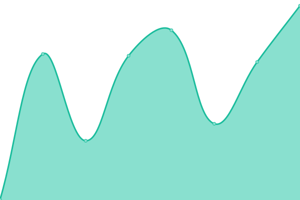
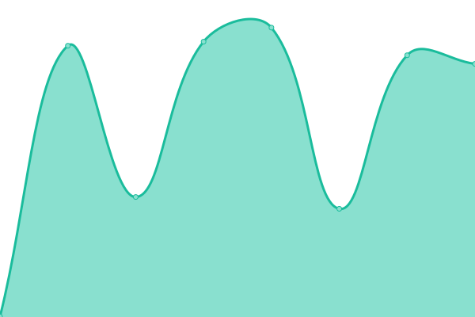
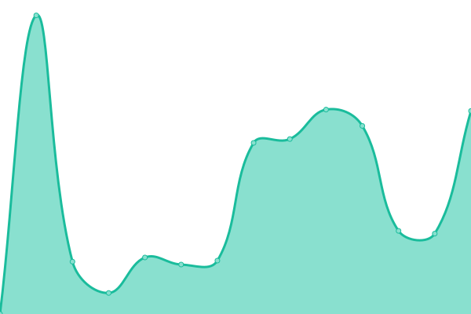
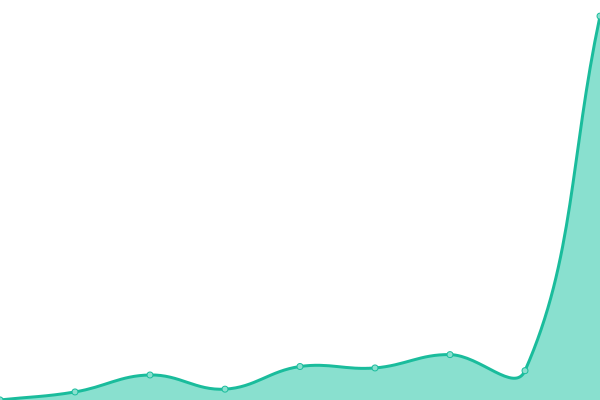
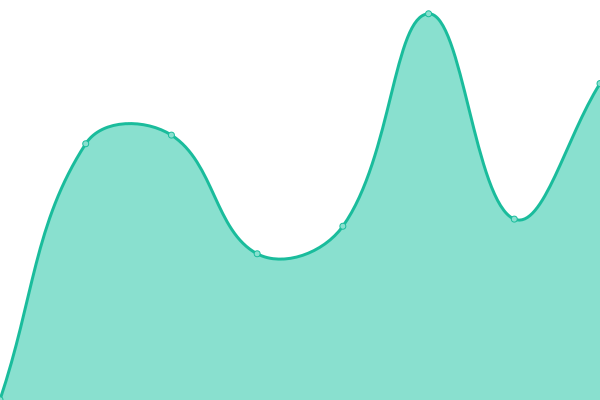
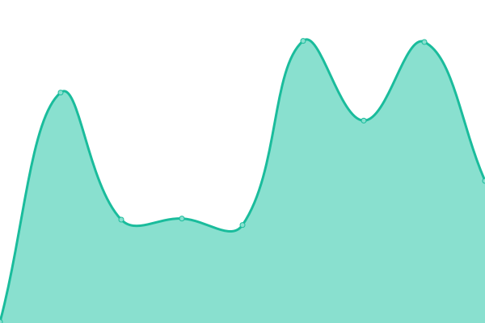

# [📈 Live Status](https://status.kiondaga.org): <!--live status--> **🟩 All systems operational**

This repository contains the open-source uptime monitor and status page for [Kiondaga Lodge, Order of the Arrow](https://kiondaga.org), powered by [Upptime](https://github.com/upptime/upptime).

With [Upptime](https://upptime.js.org), you can get your own unlimited and free uptime monitor and status page, powered entirely by a GitHub repository. We use [Issues](https://github.com/kiondaga/status/issues) as incident reports, [Actions](https://github.com/kiondaga/status/actions) as uptime monitors, and [Pages](https://status.kiondaga.org) for the status page.

<!--start: status pages-->
<!-- This summary is generated by Upptime (https://github.com/upptime/upptime) -->
<!-- Do not edit this manually, your changes will be overwritten -->
<!-- prettier-ignore -->
| URL | Status | History | Response Time | Uptime |
| --- | ------ | ------- | ------------- | ------ |
|  [Kiondaga Lodge](https://kiondaga.org) | 🟩 Up | [kiondaga-lodge.yml](https://github.com/kiondaga/status/commits/HEAD/history/kiondaga-lodge.yml) | 

 579ms
     
 | 

<a href="https://status.kiondaga.org/history/kiondaga-lodge">100.00%</a>
    

|  [Trading Post](https://tradingpost.kiondaga.org) | 🟩 Up | [trading-post.yml](https://github.com/kiondaga/status/commits/HEAD/history/trading-post.yml) | 

 888ms
     
 | 

<a href="https://status.kiondaga.org/history/trading-post">99.26%</a>
    

|  [Dev](https://dev.kiondaga.org) | 🟩 Up | [dev.yml](https://github.com/kiondaga/status/commits/HEAD/history/dev.yml) | 

 706ms
     
 | 

<a href="https://status.kiondaga.org/history/dev">99.98%</a>
    

|  [Dev Trading Post](https://dev.tradingpost.kiondaga.org) | 🟩 Up | [dev-trading-post.yml](https://github.com/kiondaga/status/commits/HEAD/history/dev-trading-post.yml) | 

 939ms
     
 | 

<a href="https://status.kiondaga.org/history/dev-trading-post">99.24%</a>
    

|  [Stats](https://stats.kiondaga.org) | 🟩 Up | [stats.yml](https://github.com/kiondaga/status/commits/HEAD/history/stats.yml) | 

 996ms
     
 | 

<a href="https://status.kiondaga.org/history/stats">100.00%</a>
    

|  [Portal](https://portal.kiondaga.org) | 🟩 Up | [portal.yml](https://github.com/kiondaga/status/commits/HEAD/history/portal.yml) | 

 331ms
     
 | 

<a href="https://status.kiondaga.org/history/portal">99.32%</a>
    

|  [Social](https://social.kiondaga.org) | 🟩 Up | [social.yml](https://github.com/kiondaga/status/commits/HEAD/history/social.yml) | 

 157ms
     
 | 

<a href="https://status.kiondaga.org/history/social">99.33%</a>
    

|  Link Shortener | 🟩 Up | [link-shortener.yml](https://github.com/kiondaga/status/commits/HEAD/history/link-shortener.yml) | 

 423ms
     
 | 

<a href="https://status.kiondaga.org/history/link-shortener">100.00%</a>
    

<!--end: status pages-->

[**Visit our status website →**](https://status.kiondaga.org)

## 📄 License

- Powered by: [Upptime](https://github.com/upptime/upptime)
- Code: [MIT](./LICENSE) © [Kiondaga Lodge, Order of the Arrow](https://kiondaga.org)
- Data in the `./history` directory: [Open Database License](https://opendatacommons.org/licenses/odbl/1-0/)
