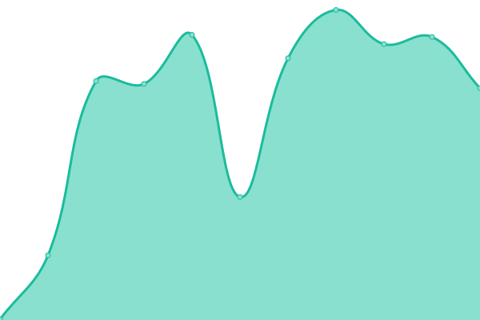
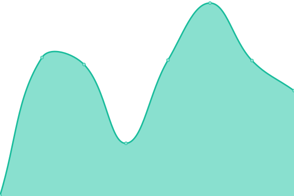
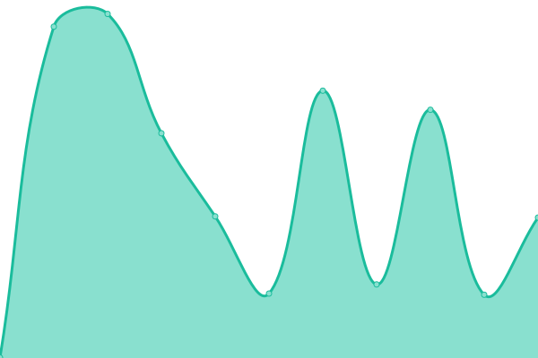
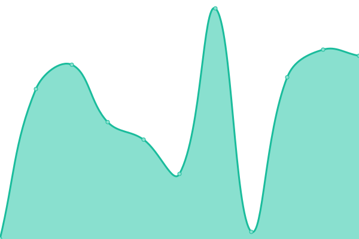
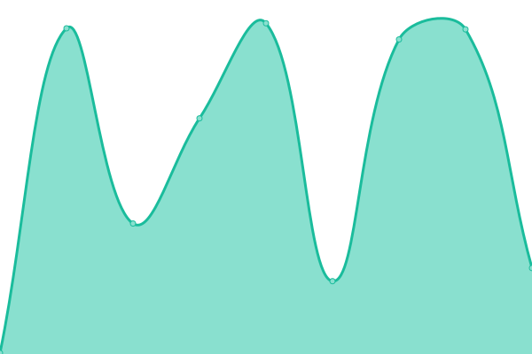
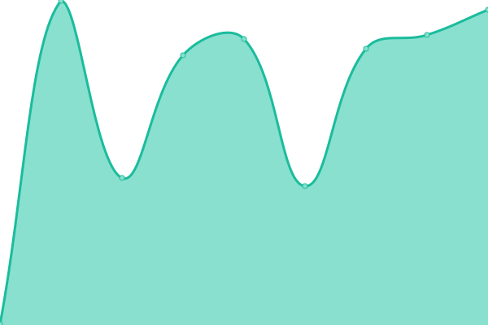
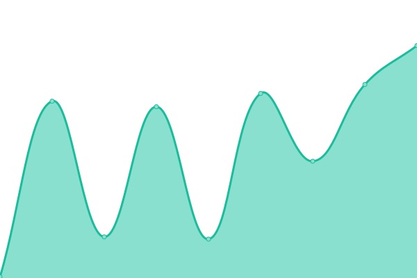
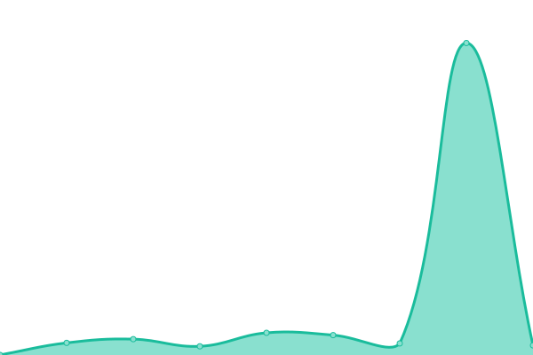

# [📈 Live Status](https://status.kiondaga.org): <!--live status--> **🟩 All systems operational**

This repository contains the open-source uptime monitor and status page for [Kiondaga Lodge, Order of the Arrow](https://kiondaga.org), powered by [Upptime](https://github.com/upptime/upptime).

With [Upptime](https://upptime.js.org), you can get your own unlimited and free uptime monitor and status page, powered entirely by a GitHub repository. We use [Issues](https://github.com/kiondaga/status/issues) as incident reports, [Actions](https://github.com/kiondaga/status/actions) as uptime monitors, and [Pages](https://status.kiondaga.org) for the status page.

<!--start: status pages-->
<!-- This summary is generated by Upptime (https://github.com/upptime/upptime) -->
<!-- Do not edit this manually, your changes will be overwritten -->
<!-- prettier-ignore -->
| URL | Status | History | Response Time | Uptime |
| --- | ------ | ------- | ------------- | ------ |
|  [Website - Production](https://kiondaga.org) | 🟩 Up | [website-production.yml](https://github.com/kiondaga/status/commits/HEAD/history/website-production.yml) | 

 397ms
     
 | 

<a href="https://status.kiondaga.org/history/website-production">100.00%</a>
    

|  [Website - Development](https://dev.kiondaga.org) | 🟩 Up | [website-development.yml](https://github.com/kiondaga/status/commits/HEAD/history/website-development.yml) | 

 2309ms
     
 | 

<a href="https://status.kiondaga.org/history/website-development">100.00%</a>
    

|  [Website - Staging](https://stage.kiondaga.org) | 🟩 Up | [website-staging.yml](https://github.com/kiondaga/status/commits/HEAD/history/website-staging.yml) | 

 345ms
     
 | 

<a href="https://status.kiondaga.org/history/website-staging">100.00%</a>
    

|  [Trading Post - Production](https://tradingpost.kiondaga.org) | 🟩 Up | [trading-post-production.yml](https://github.com/kiondaga/status/commits/HEAD/history/trading-post-production.yml) | 

 343ms
     
 | 

<a href="https://status.kiondaga.org/history/trading-post-production">100.00%</a>
    

|  [Trading Post - Development](https://dev-tradingpost.kiondaga.org) | 🟩 Up | [trading-post-development.yml](https://github.com/kiondaga/status/commits/HEAD/history/trading-post-development.yml) | 

 361ms
     
 | 

<a href="https://status.kiondaga.org/history/trading-post-development">100.00%</a>
    

|  [Statistics](https://stats.kiondaga.org) | 🟩 Up | [statistics.yml](https://github.com/kiondaga/status/commits/HEAD/history/statistics.yml) | 

 620ms
     
 | 

<a href="https://status.kiondaga.org/history/statistics">100.00%</a>
    

|  [Committee Portal](https://portal.kiondaga.org) | 🟩 Up | [committee-portal.yml](https://github.com/kiondaga/status/commits/HEAD/history/committee-portal.yml) | 

 332ms
     
 | 

<a href="https://status.kiondaga.org/history/committee-portal">100.00%</a>
    

|  [Social Links](https://social.kiondaga.org) | 🟩 Up | [social-links.yml](https://github.com/kiondaga/status/commits/HEAD/history/social-links.yml) | 

 141ms
     
 | 

<a href="https://status.kiondaga.org/history/social-links">100.00%</a>
    

|  URL Shortener | 🟩 Up | [url-shortener.yml](https://github.com/kiondaga/status/commits/HEAD/history/url-shortener.yml) | 

 274ms
     
 | 

<a href="https://status.kiondaga.org/history/url-shortener">100.00%</a>
    

<!--end: status pages-->

[**Visit our status website →**](https://status.kiondaga.org)

## 📄 License

- Powered by: [Upptime](https://github.com/upptime/upptime)
- Code: [MIT](./LICENSE) © [Kiondaga Lodge, Order of the Arrow](https://kiondaga.org)
- Data in the `./history` directory: [Open Database License](https://opendatacommons.org/licenses/odbl/1-0/)
